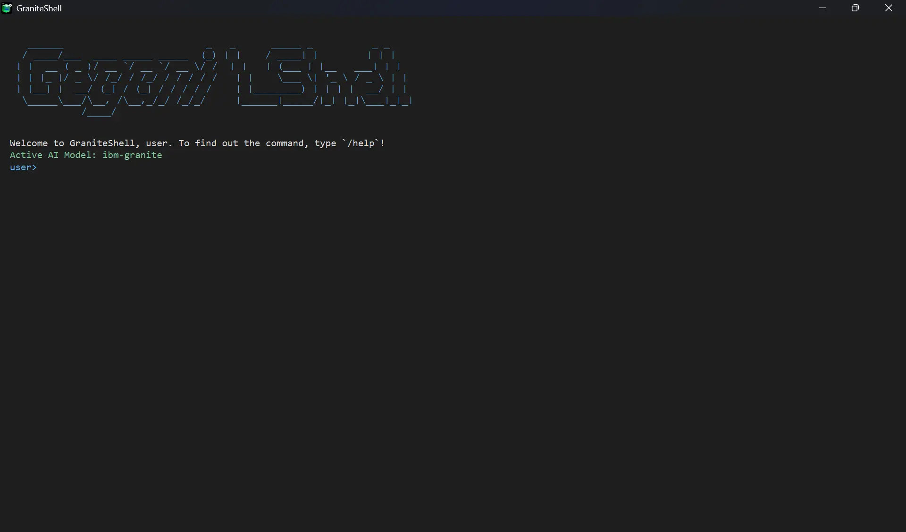

# Website Resmi GraniteShell

<p align="center">
  
</p>

Selamat datang di repository resmi untuk kode sumber website GraniteShell. Website ini berfungsi sebagai halaman perkenalan (*landing page*), pusat informasi, dan tempat untuk mengunduh rilis terbaru dari aplikasi [GraniteShell Terminal](https://github.com/Oenm176/GraniteShell).

**[➡️ Lihat Website Live](https://graniteshell.netlify.app/)**

---

## 🚀 Teknologi yang Digunakan

Website ini dibangun menggunakan tumpukan teknologi modern yang berfokus pada kecepatan dan pengalaman developer:

* **Framework:** [**Astro**](https://astro.build/) - Untuk membangun website yang super cepat.
* **Styling:** [**Tailwind CSS**](https://tailwindcss.com/) - Untuk desain antarmuka yang modern dan responsif.
* **Deployment:** [**Firebase Hosting**](https://firebase.google.com/docs/hosting) - Untuk hosting yang cepat, aman, dan terukur.
* **Content:** [**Astro Content Collections**](https://docs.astro.build/en/guides/content-collections/) - Untuk mengelola konten seperti halaman Rencana (Roadmap).

---

## 🛠️ Menjalankan Proyek Secara Lokal

Jika Anda ingin menjalankan website ini di komputer Anda sendiri, ikuti langkah-langkah berikut:

1.  **Clone repository ini:**
    ```bash
    git clone [https://github.com/Oenm176/GraniteShell-site.git](https://github.com/Oenm176/GraniteShell-site.git)
    ```

2.  **Masuk ke direktori proyek:**
    ```bash
    cd GraniteShell-site
    ```

3.  **Install semua dependensi:**
    ```bash
    npm install
    ```

4.  **Jalankan server development:**
    ```bash
    npm run dev
    ```
    Website akan berjalan secara lokal di `http://localhost:4321`.

---

## ❤️ Kontribusi

Kami sangat terbuka untuk kontribusi dalam bentuk apa pun untuk meningkatkan website ini. Jika Anda menemukan kesalahan ketik, bug, atau punya ide untuk perbaikan, silakan buat **[Issue](https://github.com/Oenm176/GraniteShell-site/issues)** atau **[Pull Request](https://github.com/Oenm176/GraniteShell-site/pulls)**.

---

## 📄 Lisensi

Kode sumber website ini dirilis di bawah **Lisensi MIT**.
